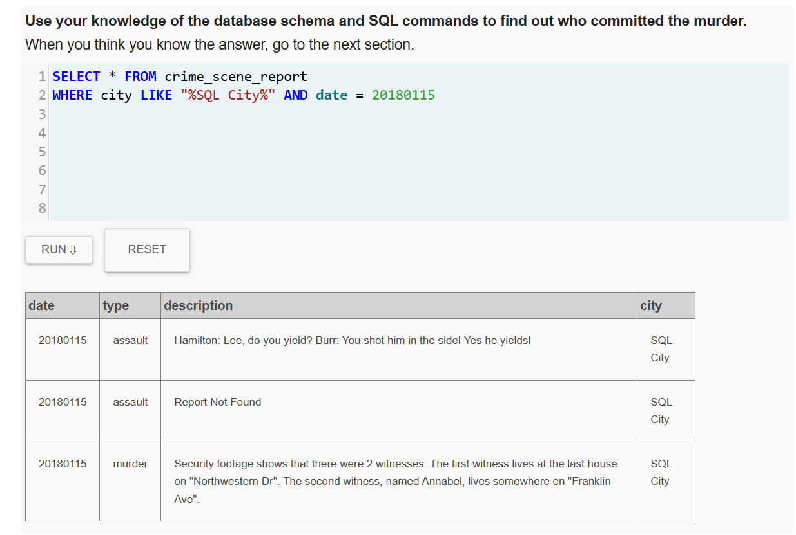
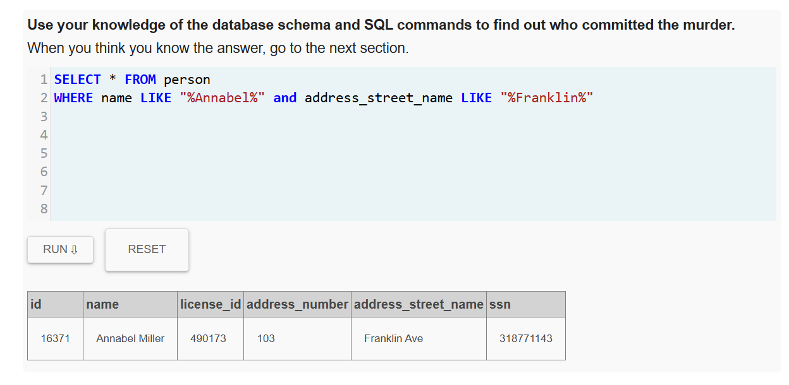
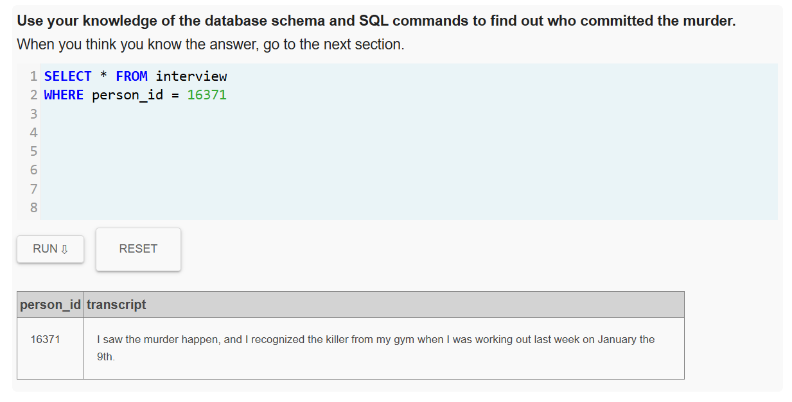
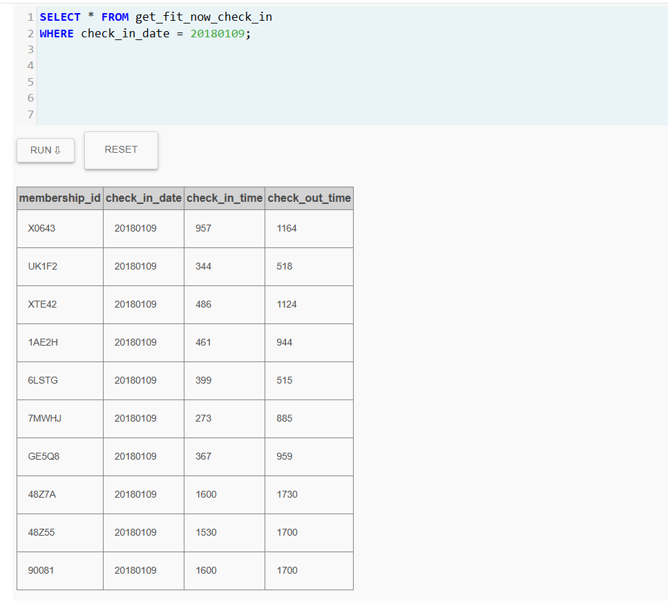
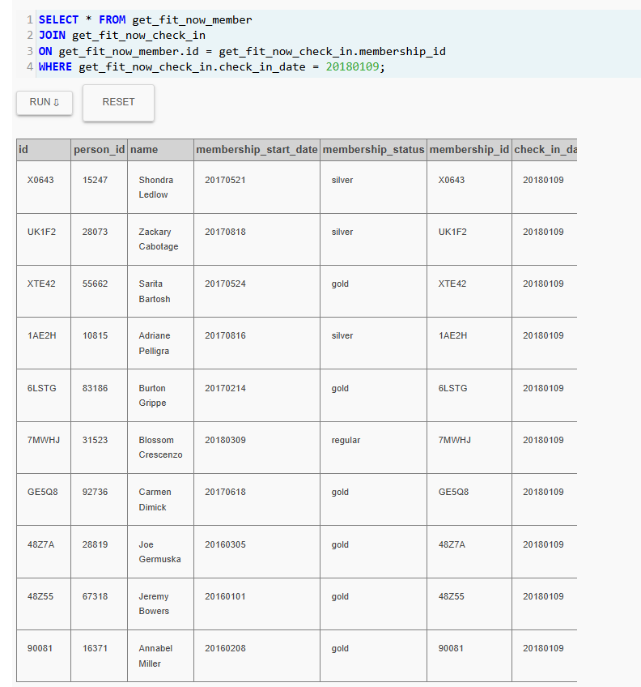
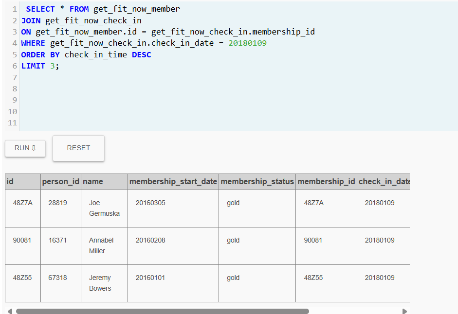
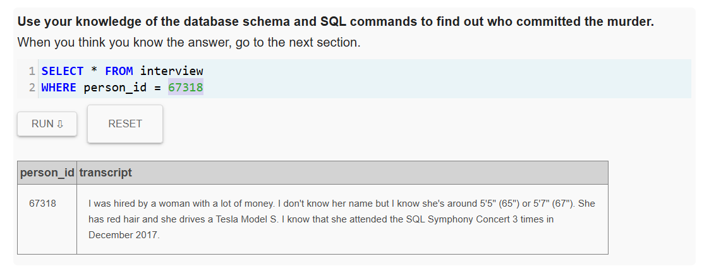
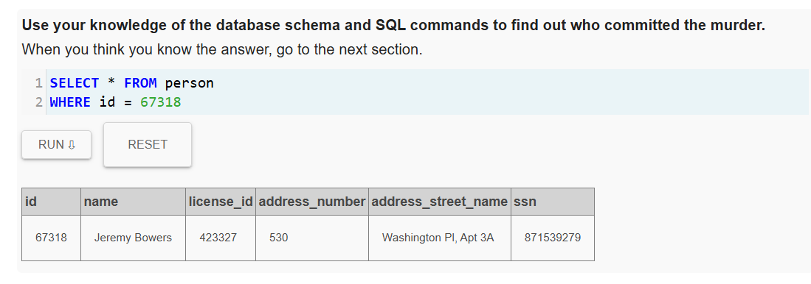
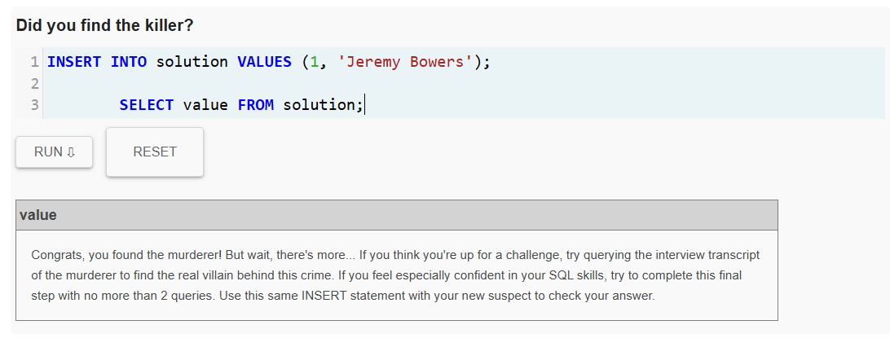
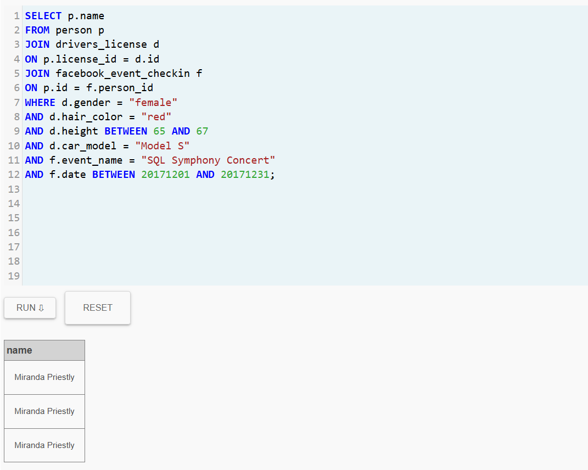

# lab2-sql-murder-DubanLopez


## Datos

* **Detective**: Duban Lopez Sanchez
* **Correo**: duban.lopezs@udea.edu.co


## Resumen del Caso

El asesinato fue cometido por Jeremy Bowers, quien confeso haber sido contratado para realizar el crimen. Durante la investigación se descubrió que él no actuó por cuenta propia, sino que fue contratado por una mujer adinerada.


## Bitácora de Investigación

### Query 1
```sql
SELECT * FROM crime_scene_report
WHERE city LIKE "%SQL City%" AND date = 20180115
```
**Evidencia**


> **Conclusión**
> Se buscaron los crímenes relacionados con la fecha y ciudad, y al momento de centrarme en el asesinato puedo observar que tenemos dos testigos.


### Query 2
```sql
SELECT * FROM person 
WHERE name LIKE "%Annabel%" and address_street_name LIKE "%Franklin%"
```
**Evidencia**


## Conclusion
Encontré información personal de este testigo con la cual se pudo seguir avanzando en la investigación.


### Query 3
```sql
SELECT * FROM interview
WHERE person_id = 16371
```
**Evidencia**


## Conclusion
 Se llego a una entrevista en la cual se descubrió que la testigo reconoció a el asesino en el gimnasio el pasado 9 de enero de 2018.


 ### Query 4
```sql
SELECT * FROM get_fit_now_check_in
WHERE check_in_date = 20180109;
```
**Evidencia**


## Conclusion
Se encontraron las personas que estuvieron en el gimnasio el 9 de enero de 2018, y esto permitió buscar más información gracias a sus IDS.


 ### Query 5
```sql
SELECT * FROM get_fit_now_member 
JOIN get_fit_now_check_in 
ON get_fit_now_member.id = get_fit_now_check_in.membership_id
WHERE get_fit_now_check_in.check_in_date = 20180109;
```
**Evidencia**


## Conclusion
Se halló información de las personas que estuvieron ese día en el gimnasio, teniendo en cuenta cosas como el ID, el nombre, y la hora de entrada y de salida.


 ### Query 6
```sql
SELECT * FROM get_fit_now_member 
JOIN get_fit_now_check_in 
ON get_fit_now_member.id = get_fit_now_check_in.membership_id
WHERE get_fit_now_check_in.check_in_date = 20180109
ORDER BY check_in_time DESC
LIMIT 3;
```
**Evidencia**


## Conclusion
Gracias a la hora de entrada y de salida (Las personas que estuvieron más tarde en el gimnasio), se pudo observar que la señora Annabel (Testigo) solo se cruzó con las ultimas 3 personas que fueron al gimnasio ese día.


 ### Query 7
```sql
SELECT * FROM interview
WHERE person_id = 67318
```
**Evidencia**


## Conclusion
Se consulto las entrevistas de ambas personas, y encontré que el principal sospechoso es la persona con id: 67318, gracias a que él lo revela y también teniendo en cuenta que la otra persona no contaba con entrevista.


 ### Query 8
```sql
SELECT * FROM person
WHERE id = 67318
```
**Evidencia**


## Conclusion
Se consulto la información de la persona sospechosa.


 ### Query 9
```sql
INSERT INTO solution VALUES (1, 'Jeremy Bowers');
SELECT value FROM solution;
```
**Evidencia**


## Conclusion
Descubrí que el asesinato lo realizó Jeremy Bowers.


 ### Query 10
```sql
SELECT p.name
FROM person p
JOIN drivers_license d 
ON p.license_id = d.id
JOIN facebook_event_checkin f 
ON p.id = f.person_id
WHERE d.gender = "female"
AND d.hair_color = "red"
AND d.height BETWEEN 65 AND 67
AND d.car_model = "Model S"
AND f.event_name = "SQL Symphony Concert"
AND f.date BETWEEN 20171201 AND 20171231;
```
**Evidencia**


## Conclusion
Gracias a toda la información que había suministrado Jeremy Bowers en la entrevista, se encuentra que el nombre de la sospechosa que ordenó el asesinato es Miranda Priestly.


 ### Query 11
```sql
INSERT INTO solution VALUES (1, 'Miranda Priestly');
SELECT value FROM solution;
```
**Evidencia**


## Conclusion
Se confirma que el cerebro detrás de este asesinato es Miranda Priestly y se cierra el caso. 
